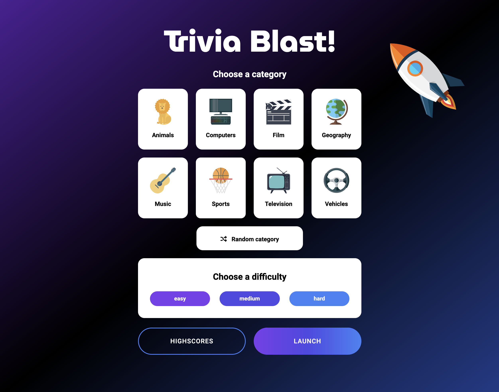
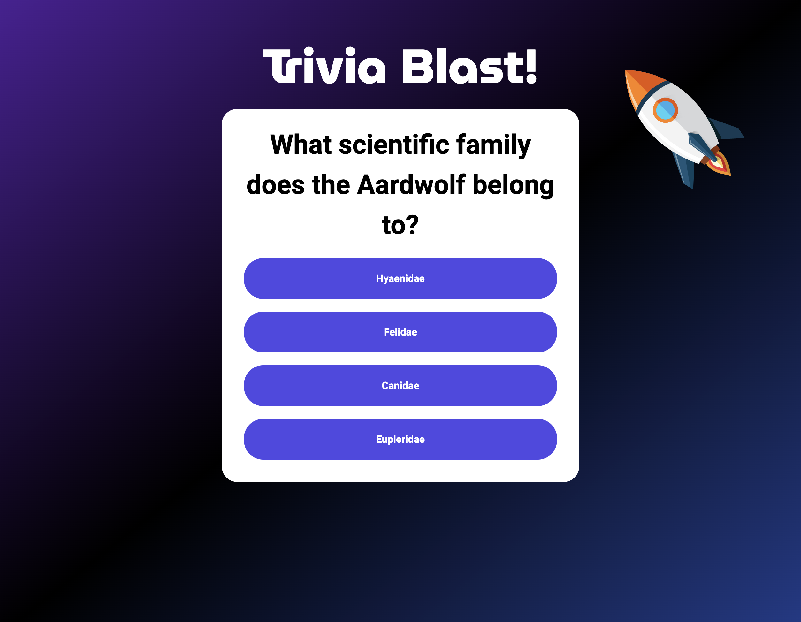
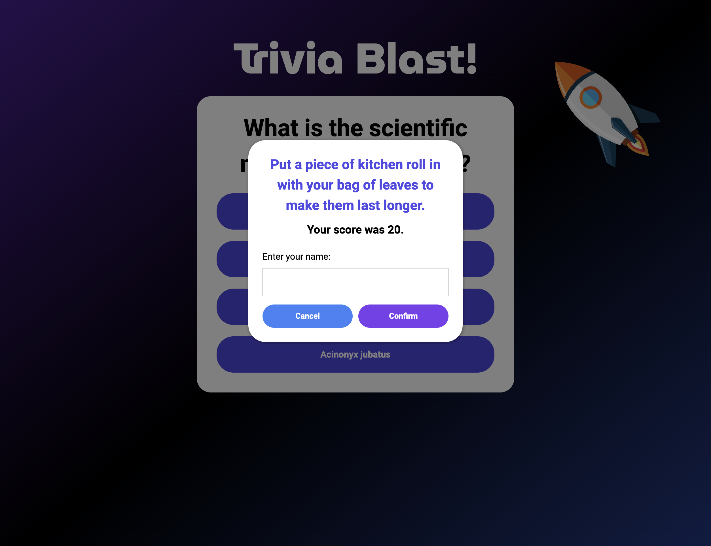
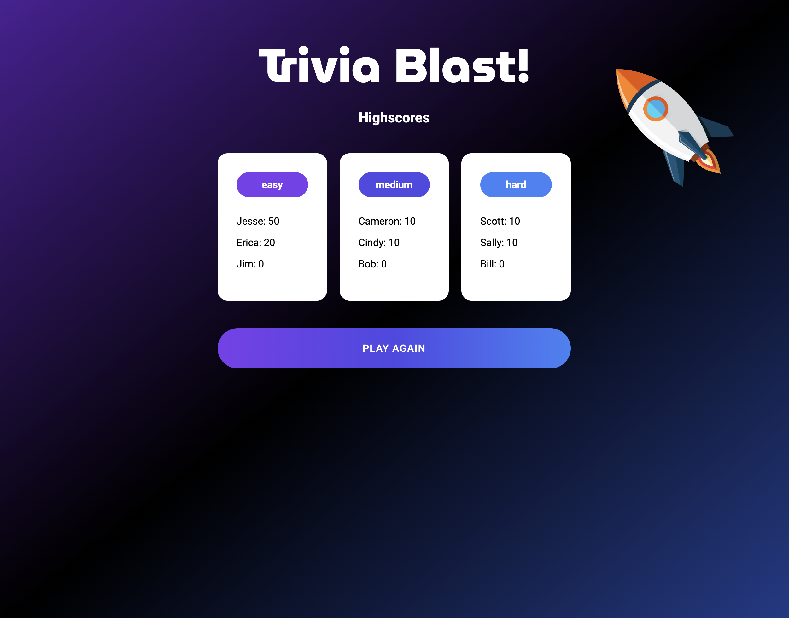

# Trivia Blast!

## Table of contents
* [Description](#description)
* [Technologies](#technologies)
* [Process](#process)
* [Credits](#credits)
* [Results](#results)
* [Contributers](#contributers)

## Description
Trivia Blast! is a unique quiz app which allows users to customize their own quiz experience by choosing from eight categories and three levels of difficulty. Once a user chooses their trivia journey, they will attempt to answer all 10 questions correctly. If the player answers incorrectly the game is over- but they won’t feel discouraged! Trivia Blast! will provide “inspirational advice” to maintain a positive attitude before their next attempt. At the end of each game, high scores can be saved so the user has the opportunity to beat it on their next try. Can they score a perfect 10 out of 10? 

## Motivation
We wanted to utilize what we've learned about APIs to add a more advanced spin to the quiz format we were more familiar with. We also wanted to come up with a concept that would have the flexibility to grow in future versions. As a whole, we wanted a project idea that would flex our creativity by making a relatively simple concept more unique and exciting.

## User Story
AS A trivia fanatic
I WANT a quiz app that allows me to choose my category and level of difficulty
SO THAT I can test my knowledge in various categories at different levels.
	
## Technologies
Project was created using:
* VS Code
* HTML
* CSS
* JavaScript
* Git
* GitHub
* APIs
* Open Trivia API
* Advice Slip API
* Google Fonts API
* TailWindCSS
* Font Awesome

## Challenges
* Following the GitHub Process as a group
* Utilizing TailwindCSS as a framework, combining it with regular CSS successfully
* Thinking of a creative concept that can incorporate more than one API
* Figuring out how to display modals

## Successes
* Collaborating as a group
* Concepualizing a common goal and being on the same page
* Learning from and capitalizing on our errors and mistakes
* Bringing the product to life!

## Process
### STEP 1. - SETUP
* Create a GitHub repository
* Created base HTML, CSS, and JavaScript files
* Pushed files into the new Repo using Git
* Define GitHub Issues to be completed throughout the process

### STEP 2. - BASE HTML & CSS
* Design wireframe and mockup
* Define basic HTML containers for JavaScript functionality
* Create base styles using CSS and TailwindCSS

### STEP 3. - FETCH APIs
* Fetch Trivia API and extract only necessary data
* Fetch Advice API

### STEP 4. - CREATE TRIVIA QUIZ
* Style start page using CSS and TailwindCSS with buttons and elements to choose quiz parameters
* Use Trivia API to create basic quiz functionality
* Use Javascript to append quiz functionality to the DOM
* Style base quiz functionality and DOM manipulation with CSS

### STEP 5. - ADD INSPIRATIONAL ADVICE
* Use Advice API to create quiz functionality
* Style quiz functionality with CSS

### STEP 6. - CREATE HIGHSCORES PAGE
* Use HTML and CSS to create framework for highscore page
* Set score data in local storage
* Get score data from local storage and display on highscore page

### STEP 7. - TEST AND DEPLOY
* Work out bugs and enhancements
* Refactor HTML, CSS, and JavaScript
* Deploy to main branch 
* Test Version 1.0 functionality in GitHub pages
* Create GitHub Issues for Version 2.0

### STEP 8. - VERSION 2.0
* Add various enhancements to style and functionality
* Add bronze, silver, gold medal functionality
* Create mobile responsiveness
* Upon incorrect answer, show correct answer

### STEP 9. - FINALIZE AND DEPLOY 
* Finalize ReadMe
* Refactor HTML, CSS, and JavaScript
* Deploy to main branch 

## Directions for Future Development
* Extend quiz to run until user gets an answer incorrect
* Interactivity between users on different devices
* Social media sharing
* Expand theme and aesthetics of interface

## Credits
Open Trivia API: https://opentdb.com/api_config.php

Advice Slip API: https://api.adviceslip.com/advice

Google Fonts API: https://fonts.googleapis.com

TailwindCSS: https://cdnjs.cloudflare.com/ajax/libs/tailwindcss/2.2.19/tailwind.min.css

Font Awesome: https://cdnjs.cloudflare.com/ajax/libs/font-awesome/6.0.0/css/all.min.css

## Results
* GitHub URL: https://etrenholm.github.io/trivia-blast/
* GitHub Repository: https://github.com/etrenholm/trivia-blast
* Mockup:

## Contributers
* Jesse Lemieux: https://github.com/Jesse-Lemieux
* Cameron Davis: https://github.com/PaccC8
* Erica Trenholm: https://github.com/etrenholm

### ©️ March 2022